<div align="center">
  
# 👋 Hello, I'm Kawsar Mahmud Tanveer Khan


</div>

---

## 🚀 About Me

```yaml
name: "Kawsar Mahmud Tanveer Khan"
location: "Dhaka, Bangladesh 🇧🇩"
education: "EEE Final Year | Daffodil International University"
specialization: ["Networking", "IoT", "Embedded Systems"]
current_focus: "Cyber-Physical Threat Detection in Smart Grid Communications"
career_goal: "Network Engineer at a Multinational Company"
fun_fact: "Can switch between coding and soldering in the same hour without coffee ☕"
```

<div align="center">

### 🌟 Building the future with IoT, one microcontroller at a time

</div>

---

## 🛠️ Tech Arsenal

<div align="center">

### 💻 Languages & Frameworks


### 🔧 Tools & Technologies


### � Networking & IoT


</div>

---

## 🏆 Featured Projects

<div align="center">

<table>
<tr>
<td width="50%">

### 🌞 MPPT Solar Charge Controller
*ESP32-Based Intelligent Power Management*

- **98% charging efficiency** with MPPT algorithm
- Real-time monitoring via **Blynk IoT platform**
- Automated solar panel protection system
- Remote control & data logging capabilities

**Tech Stack:** `ESP32` `Arduino IDE` `Blynk` `Power Electronics`

[🔗 View Project](https://github.com/KMTanVeer/mppt-solar-controller) | [📖 Live Demo](https://itanveer.tech/project-mppt-solar.html)

</td>
<td width="50%">

### ⚡ Online UPS System
*Advanced Power Protection Solution*

- **Zero transfer time** switching
- Modular architecture with specialized driver cards
- Comprehensive battery management system
- ESP32 integration for smart monitoring

**Tech Stack:** `Power Electronics` `ESP32` `SPWM Control` `IoT`

[🔗 View Project](https://github.com/KMTanVeer/online-ups-design) | [📖 Live Demo](https://itanveer.tech/project-online-ups.html)

</td>
</tr>
<tr>
<td width="50%">

### 📱 Arduino Digital Multimeter
*Precision Measurement Device*

- Multi-parameter measurement capabilities
- Digital display with user-friendly interface
- Calibrated for accurate readings
- Portable and cost-effective design

**Tech Stack:** `Arduino` `C++` `Electronics` `PCB Design`

[🔗 View Project](https://github.com/KMTanVeer/arduino-multimeter)

</td>
<td width="50%">

### 🛡️ Smart Grid Security (Thesis)
*Cyber-Physical Threat Detection*

- Advanced threat detection algorithms
- Communication network security analysis
- Real-time monitoring and alerting
- Machine learning-based anomaly detection

**Tech Stack:** `Python` `Network Security` `ML` `Smart Grid`

[📝 Research Paper] | [🔬 Methodology]

</td>
</tr>
</table>

</div>

---

## 📊 GitHub Analytics

<div align="center">
  


</div>

<div align="center">
  


</div>

---

## 🎯 2025 Goals & Roadmap

```mermaid
graph LR
    A[🎓 Graduate EEE] --> B[🔍 Complete Thesis]
    B --> C[💼 Network Engineer Role]
    C --> D[🌐 IoT Expertise]
    D --> E[🚀 Innovation Projects]
    
    style A fill:#58A6FF,stroke:#58A6FF,color:#fff
    style B fill:#58A6FF,stroke:#58A6FF,color:#fff  
    style C fill:#28A745,stroke:#28A745,color:#fff
    style D fill:#28A745,stroke:#28A745,color:#fff
    style E fill:#FF6B35,stroke:#FF6B35,color:#fff
```

<div align="center">



</div>

### 🎯 Current Focus Areas:
- 🔬 **Thesis Completion**: Cyber-Physical Threat Detection in Smart Grids
- 💻 **Skill Enhancement**: Advanced networking protocols & IoT architectures  
- 🏢 **Career Preparation**: Targeting multinational networking companies
- 🚀 **Innovation**: Developing scalable IoT solutions for Bangladesh

---

## 🏅 Achievements & Certifications

<div align="center">

| 🏆 Achievement | 📅 Year | 🏢 Organization |
|:---|:---:|:---|
| **Mechatronics & PLC Basics** | 2024 | Industry Certification |
| **IoT Fundamentals** | 2024 | Coursera |
| **Network Security Basics** | 2024 | LinkedIn Learning |
| **Electronics Project Innovation** | 2023 | University Project |
| **MPPT Controller Implementation** | 2024 | Personal Project |

</div>

---

## 🌐 Connect & Collaborate

<div align="center">

### 📫 Let's Build Something Amazing Together!

[](https://itanveer.tech)
[](https://linkedin.com/in/kawsartanveer)
[](mailto:tanveer@itanveer.tech)

[](https://github.com/KMTanVeer)
[](https://facebook.com/itzzVeer)
[](https://x.com/itzzveer)

</div>

---

<div align="center">

### 💭 Philosophy

*"Innovation distinguishes between a leader and a follower. In the world of IoT and networking, I strive to be the bridge between traditional engineering and future technologies."*

---


**⭐ From [KMTanVeer](https://github.com/KMTanVeer) | Building Tomorrow's Connected World Today**

</div>

---

<div align="center">
  
### 🎬 Fun Corner

<details>
<summary>🎭 When I'm Not Coding...</summary>

<br>

🏍️ **Bike Riding**: Exploring the streets of Dhaka on weekends  
🎬 **Movie Buff**: Netflix and chill with sci-fi and tech thrillers  
🔧 **DIY Electronics**: Turning random components into useful gadgets  
☕ **Coffee Alternative**: Green tea powers my late-night coding sessions  
🌱 **Tech Explorer**: Always excited about the latest IoT innovations  

*Current Status: Balancing thesis writing with project development* 📚⚡

</details>

</div>
│   ├── css/
│   │   └── styles.css       # Main stylesheet
│   ├── js/
│   │   ├── main.js          # Core JavaScript functionality
│   │   └── app.js           # Additional features
│   └── img/                 # Project images and assets
└── README.md
```

## 🚀 **Key Highlights**

### **Blog System**
- **Category Filtering**: Arduino, IoT, MATLAB, Power Systems
- **Scattered Animations**: Cards scatter in random directions during filtering
- **Newsletter**: One-line subscription with glassmorphism design
- **Individual Posts**: Detailed Arduino and ESP32 tutorials

### **Projects Showcase**
- **Animated Counters**: Statistics count up from 0 to target values
- **Featured Projects**: Arduino Multimeter, Distance Protection, ESP32 IoT
- **Technology Tags**: Visual indicators for tools and languages used
- **Status Tracking**: Completed, Ongoing, Planning project states

### **Professional Contact**
- **WhatsApp**: Direct messaging for quick queries
- **Telegram**: Secure communication for tech discussions
- **Email**: Formal project discussions and collaborations
- **LinkedIn**: Professional networking and opportunities

## 🎯 **Target Audience**

- **EEE Students**: Learning resources and project tutorials
- **IoT Enthusiasts**: ESP32 and Arduino project guides
- **Professionals**: Technical collaboration and networking
- **Recruiters**: Portfolio showcase and contact information

## 📈 **Performance Features**

- **Optimized Loading**: Efficient scroll reveal system
- **Mobile Responsive**: Seamless experience across devices
- **SEO Optimized**: Meta tags and structured content
- **Fast Navigation**: Intuitive user interface

## 🤝 **Contributing**

This is a personal portfolio project, but suggestions and feedback are welcome!

## 📬 **Contact**

- **Website**: [itanveer.tech](https://itanveer.tech)
- **Email**: Professional inquiries welcome
- **WhatsApp**: Quick technical discussions
- **LinkedIn**: [Kawsar Mahmud Tanveer Khan](https://linkedin.com/in/kawsartanveer)

## 📄 **License**

© 2025 Kawsar Mahmud Tanveer Khan. All rights reserved.

---

**Built with ❤️ for the tech community**
